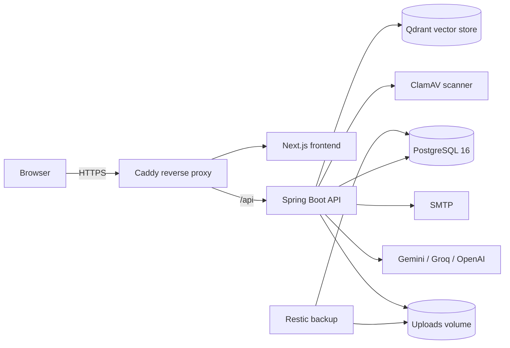
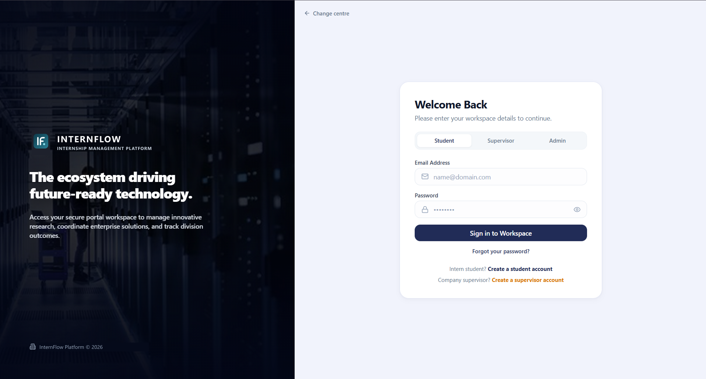
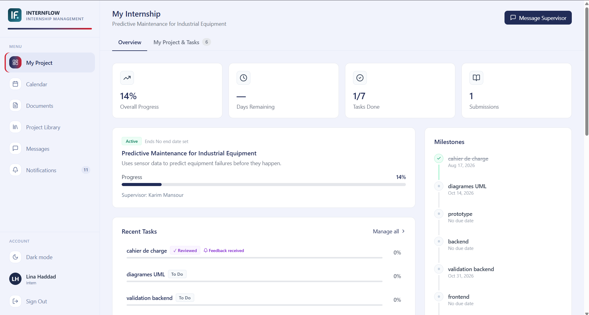
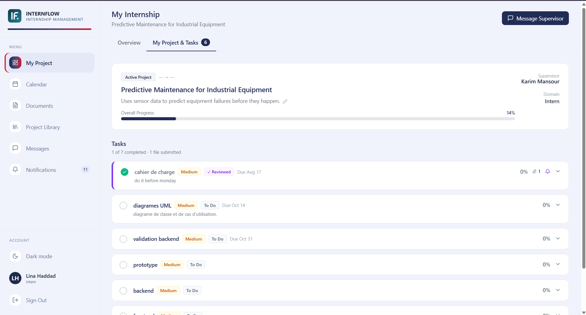
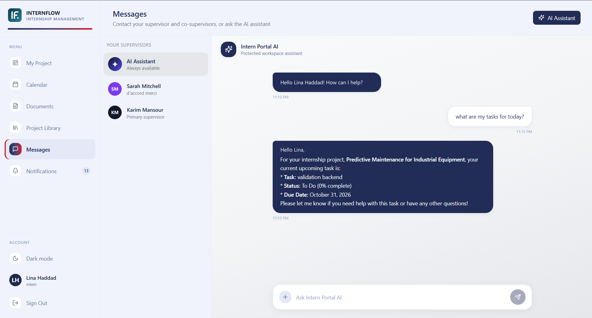
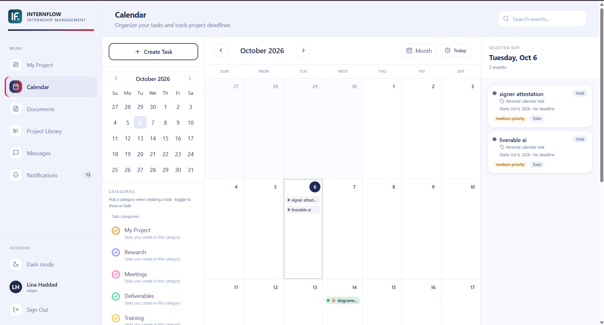
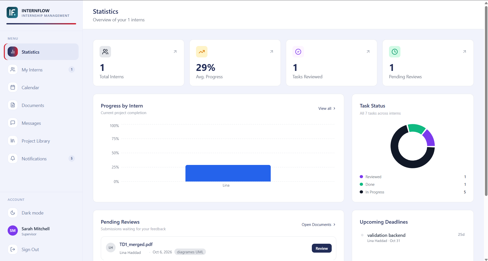
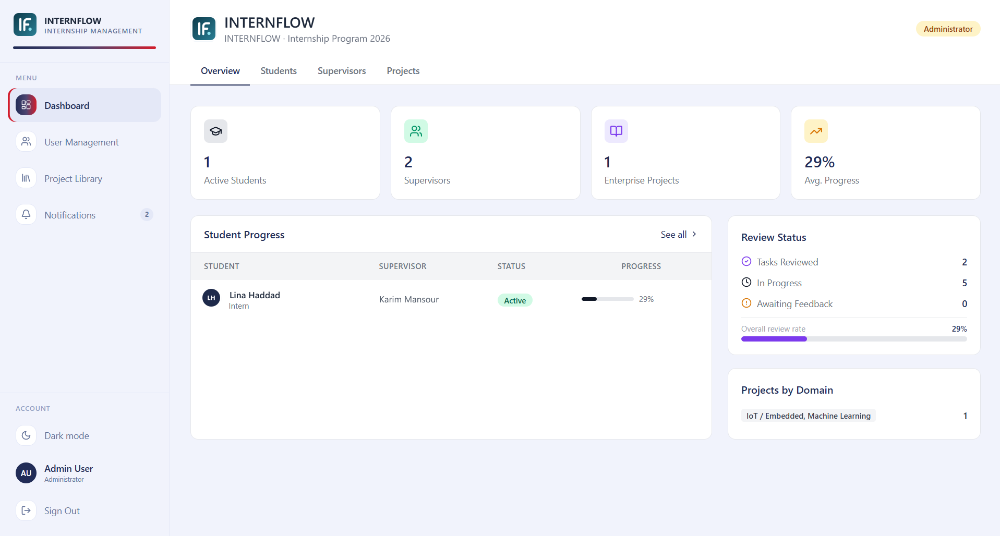
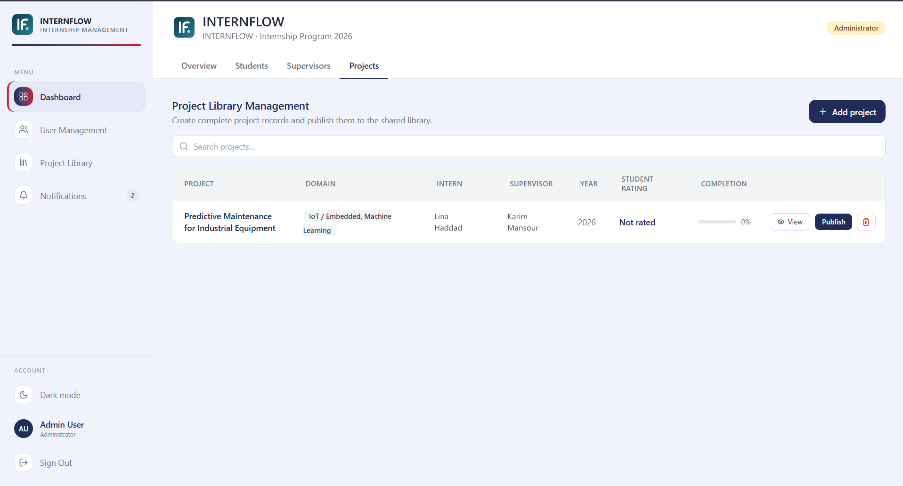

<div align="center">


# InternFlow

**A full-stack internship management platform for students, supervisors and administrators.**


</div>

---

## 🏢 Real-world project

InternFlow was designed and built during my engineering internship (2026) for a **real company**: a technology and innovation hub that hosts interns across several centres of excellence (AI, Industry 4.0, …). The company's internship programme was managed with emails and spreadsheets. I built this platform to replace that process, and it was delivered to the company's IT team for production use.

> The company's name, logos and real data have been removed from this public version. Everything else, including the architecture, features, security and deployment setup, is the delivered application.

## ✨ Features

### 👩‍🎓 Students
- Registration with email OTP verification and supervisor/administrator approval
- Personal dashboard with project, milestones, tasks and deadlines
- Document submission (reports, signed internship agreements, source code, demo videos) with feedback threads
- Calendar, notifications and direct messaging with supervisors
- Project library: browse published projects and request access to reports or source code

### 🧑‍🏫 Supervisors
- Intern overview with progress tracking and analytics charts
- Task assignment, document review and structured feedback
- Co-supervision invitations and shared access to interns
- **AI-assisted feedback drafts** and document review

### 🛡️ Administrators
- User approval and account management for every role
- Project creation, approval, publication and assignment, **including assignment to people who haven't registered yet** (linked automatically once they sign up)
- Student records, ratings and organisation by centre of excellence

### 🤖 AI & RAG
- Multi-provider AI layer (**Gemini, Groq, OpenAI**) with automatic fallback
- **Retrieval-Augmented Generation** over project reports: Gemini embeddings stored in **Qdrant**, with answers scoped to the documents the user is permitted to read
- All provider keys stay server-side; AI is disabled by default and enabled per deployment

## 🔐 Security highlights

| Area | Implementation |
|---|---|
| Authentication | bcrypt hashing, email OTP (MFA), short-lived JWT access tokens and rotating refresh-token sessions in HttpOnly cookies |
| Authorisation | Role-based route rules plus service-level ownership checks (internship, conversation, document) |
| Uploads | Type/size validation, **ClamAV malware scanning** (fails closed in production), protected download endpoints |
| Abuse protection | Rate limiting on authentication and OTP endpoints |
| Transport & headers | Caddy automatic HTTPS, strict security response headers, restricted CORS |
| Data | Flyway versioned migrations, **encrypted Restic backups** with retention policy |
| Secrets | Everything comes from environment variables; nothing sensitive is committed |

## 🏗️ Architecture



| Layer | Stack |
|---|---|
| Frontend | Next.js (App Router), React, TypeScript, Tailwind CSS, Radix UI / shadcn/ui, Recharts, Motion |
| Backend | Java 17, Spring Boot, Spring Security, Spring Data JPA, Flyway, Spring Mail |
| Data | PostgreSQL 16, Qdrant |
| Infrastructure | Docker Compose, Caddy, ClamAV, Restic |
| Testing | JUnit 5 with an isolated H2 test profile |

## 📁 Project structure

```text
.
├── src/                  # Next.js frontend (app router pages, components, API client)
├── backend/              # Spring Boot REST API
│   └── src/main/java/com/internflow/backend/
│       ├── controller/   # REST endpoints
│       ├── service/      # Business logic, AI providers, RAG, security services
│       ├── security/     # JWT, filters, Spring Security config
│       ├── entity/ dto/ repository/
│       └── resources/db/migration/   # Flyway migrations
├── database/             # Initial schema
├── backup/               # Restic backup container
├── docs/                 # Deployment & operations guides
├── docker-compose.yml    # Full local stack
└── docker-compose.production.yml  # HTTPS production overlay (Caddy)
```

## 🚀 Run it locally

**Requirements:** Docker Desktop (or Docker Engine + Compose).

```bash
git clone https://github.com/mmeelt/internflow-platform.git
cd internflow-platform
cp .env.example .env        # PowerShell: Copy-Item .env.example .env
```

Edit `.env` and set at least `DB_PASSWORD`, `JWT_SECRET` (`openssl rand -base64 64`), the `SMTP_*` values and `RESTIC_PASSWORD`. To create the first administrator, temporarily set `BOOTSTRAP_ADMIN_ENABLED=true` with an email and password.

```bash
docker compose up --build -d
```

Then open **http://localhost:3000**.

<details>
<summary>Run without Docker (development mode)</summary>

```bash
# Database only
docker compose up -d postgres-db

# Backend (http://localhost:8081)
cd backend && ./mvnw spring-boot:run

# Frontend (http://localhost:3000)
npm install && npm run dev
```
</details>

### Tests

```bash
cd backend && ./mvnw test   # backend unit/integration tests (H2, no external services)
npm run build               # frontend type-check and production build
```

## 📸 Screenshots

> Demo data only. All names shown are fictional.

<p align="center">
  
</p>

| Student dashboard | Project & tasks |
|---|---|
|  |  |
| **AI assistant** | **Calendar** |
|  |  |
| **Supervisor statistics** | **Admin dashboard** |
|  |  |
| **Admin project management** | |
|  | |

## 📚 Documentation

- [Deployment & operations guide](docs/DEPLOYMENT.md): production setup with HTTPS, first-admin bootstrap, backups, restore and resets
- [Operations & recovery](docs/OPERATIONS.md)

## 👩‍💻 Author

**Meriem Eltaief**, software engineering student

- GitHub: [@mmeelt](https://github.com/mmeelt)

I'm open to internship and junior developer opportunities, so feel free to reach out.

## 📄 License

[MIT](LICENSE)
